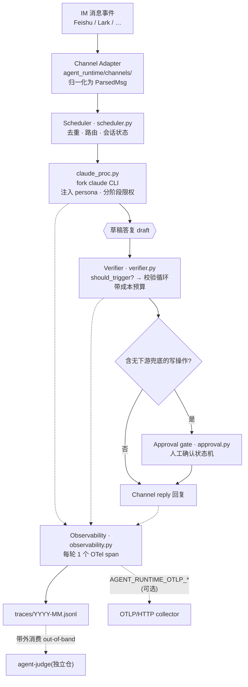

# agent-runtime

[English](README.md) | **中文**

一个 turn-by-turn（逐轮）的**数字人运行时**，把 IM 渠道（如飞书 / Lark）接到
Claude CLI 后端，内置校验循环、人工审批门控、多 project 路由，以及 OpenTelemetry 追踪。

你只需提供一个 persona（一组 Markdown 文件）和一份配置，agent-runtime 负责跑通整个循环：
收到消息 → 路由到对应的 project 上下文 → 用 Claude 起草答复 → 可选地校验草稿 →
发送（或先请求人工审批）→ 每一轮发出一个 trace span。

## 工作原理



1. **Channel adapter（渠道适配器）** 轮询 / 接收 IM 事件并把它们归一化（`agent_runtime/channels/`）。
2. **Scheduler（调度器）**（`scheduler.py`）是 turn-by-turn 的事件循环：去重、路由、会话状态，
   然后 fork 出 Claude CLI。
3. **claude_proc**（`claude_proc.py`）封装本地 `claude` CLI（`run` / `run_stream`），
   从配置的 work dir 加载 persona（`SOUL.md` / `USER.md`），并按阶段限制可用工具。
4. **Verifier（校验器）**（`verifier.py`）通过纯触发规则判断一份草稿是否值得做一次
   "第二双眼睛"复核（量化结论、服务标识符、运维动词、SQL、金额……），
   然后在一个成本预算内跑校验循环。
5. **Approval（审批）**（`approval.py`）用一个人工审批状态机门控那些没有下游安全兜底的写操作。
6. **Observability（可观测性）**（`observability.py`）每一轮向本地 JSONL 文件发出一个
   OTel 形态的 span，并可选地推送到任意 OTLP/HTTP collector。

## 架构：扩展点

| 缝（Seam） | 位置 | 如何替换 |
|---|---|---|
| **Model runner（模型运行器）** | `claude_proc.py` + `verifier.verify(_runner=…)` | 调度器构建一个 fork `claude` CLI 的 runner 闭包；你可以注入自己的 `async runner(*, work_dir, question, draft) -> str`。 |
| **Channel（渠道）** | `agent_runtime/channels/`（`ChannelAdapter` protocol + `registry`） | 为 Slack/Discord 等实现 `ChannelAdapter` 并注册它。飞书（经公开的 `lark-cli`）作为参考适配器随仓发布。 |
| **Observability（可观测性）** | `observability.py` | 文件导出器始终开启；设置 `AGENT_RUNTIME_OTLP_*` 即可同时推送到你的 collector。只改这一个模块就能换后端。 |
| **Persona / context（人设 / 上下文）** | `templates/meta/*.template` → 你的 work dir | `SOUL.md` / `USER.md` 等存放在本地 work dir（绝不进仓）；`bootstrap.sh` 从模板生成它们。 |

## OTel trace 约定

每一轮发出一个 span（遵循 OpenTelemetry GenAI 语义约定）：

- 自定义属性放在 `digital_agent.*` 命名空间下（如 `digital_agent.chat_id`、
  `digital_agent.text_len`、`digital_agent.is_alert`、`digital_agent.tool_use_count`）。
- 厂商中立的 GenAI 键：`gen_ai.request.model`、`gen_ai.usage.input_tokens` /
  `output_tokens`。
- span 以 JSON 行追加到 `{state_dir}/traces/YYYY-MM.jsonl`。

可观测性环境变量（全部可选——不设任何变量时文件导出仍正常工作）：

```
AGENT_RUNTIME_OTLP_ENDPOINT      collector 的完整 OTLP/HTTP URL（设置即启用 OTLP）
AGENT_RUNTIME_OTLP_HEADERS_JSON  header → 值 的 JSON 对象（如鉴权）
AGENT_RUNTIME_OTLP_SERVICE_NAME  service.name 资源属性（默认：agent-runtime）
```

## 快速开始

```bash
python3.11 -m venv .venv && . .venv/bin/activate
pip install -e ".[dev]"

cp config.example.yaml config.yaml      # 编辑：channel、projects、work dir、admin ids
bash scripts/bootstrap.sh               # 把 persona 文件生成到你的 work dir（交互式）

agent-runtime --config config.yaml      # 跑循环
# 或：bash scripts/run.sh
```

需要 Python 3.11+，以及 PATH 上的 `claude` CLI（模型后端）。飞书 channel
还额外需要公开的 `lark-cli`。

## 配置

`config.example.yaml` 是带注释的模板。主要小节：

- `channels:` —— 启用哪些 IM 适配器（`feishu`，……）及其设置。
- `projects:` —— 具名的 project 上下文，含 `work_dir`、路由关键词、admin 用户、
  审批超时，以及分阶段的工具限制。
- `paths.meta_work_dir` —— persona / 上下文 Markdown 存放的位置（本地，不进仓）。
- `runtime:` —— session 文件、verifier 预算、超时。

配置写入器（`config_writer.py`）使用 ruamel.yaml 的 roundtrip 模式原地编辑
`config.yaml`，因此 `/agent` 管理命令不会破坏注释和键顺序。

此外还有两个可移植性开关（均可选）：

- `AGENT_RUNTIME_KEEP_PROXY=1` —— 保留出站 proxy（默认会剥离 proxy 并设
  `NO_PROXY=*`，适合直连上游的宿主机）。
- `AGENT_RUNTIME_TZ` —— 覆盖时区（默认 `Asia/Shanghai`）。

## 测试

```bash
pip install -e ".[dev]"
pytest -q          # 655 个测试
```

## 部署

`scripts/` 提供 systemd（`install-systemd.sh` + `agent-runtime.service`）和 macOS
launchd（`install-service.sh`、`install-timers-macos.sh`）安装器，以及用于定时
ingest/backup 任务的 cron 安装器。它们都默认仓库 clone 在 `~/agent-runtime`；
否则需要自行编辑 unit 里的路径。前述 `AGENT_RUNTIME_KEEP_PROXY` /
`AGENT_RUNTIME_TZ` 开关在部署到不同宿主机时尤其有用。

## License

MIT —— 见 [LICENSE](LICENSE)。
